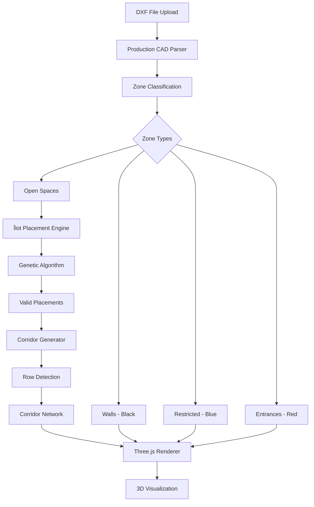

# Advanced CAD SDK Viewer Guide

## 🎯 Overview

The **Advanced CAD SDK Viewer** is a production-grade, Three.js-based 3D visualization system for architectural floor plan processing. It provides:

- **Real-time 3D rendering** with accurate CAD geometry
- **Automatic îlot placement** with configurable size distribution
- **Intelligent corridor generation** between îlot rows
- **Minimal UI** with essential controls only
- **Color-coded visualization** following architectural standards

## 🚀 Quick Start

### 1. Install Dependencies

```bash
pip install -r requirements_production.txt
```

### 2. Start the Viewer

```bash
./start_advanced_viewer.sh
```

Or manually:

```bash
python3 advanced_viewer_api.py 5000
```

### 3. Access the Viewer

Open your browser and navigate to:
```
http://localhost:5000/
```

## 📐 System Architecture



## 🎨 Color Coding System

The viewer strictly follows architectural color standards:

| Element | Color | RGB | Purpose |
|---------|-------|-----|---------|
| **Walls (MUR)** | Black | `#1a1a1a` | Structural boundaries - îlots CAN touch |
| **Restricted (NO ENTREE)** | Blue | `#4682ff` | Stairs, elevators - NO îlots |
| **Entrance (ENTREE/SORTIE)** | Red | `#ff4444` | Doors, exits - NO îlot contact |
| **Îlots** | Green | `#2ecc71` | Placed storage units |
| **Corridors** | Purple | `#9b59b6` | Auto-generated pathways |

## 🔧 Configuration Parameters

### Îlot Size Distribution

Define the percentage of each îlot size category:

- **0-1 m²** (Micro): Compact storage units
- **1-3 m²** (Small): Standard small units
- **3-5 m²** (Medium): Medium storage
- **5-10 m²** (Large): Large storage spaces

**Important**: Total must equal 100%

### Placement Parameters

| Parameter | Range | Default | Description |
|-----------|-------|---------|-------------|
| **Total Îlots** | 20-300 | 100 | Number of îlots to place |
| **Corridor Width** | 1.0-3.0 m | 1.5 m | Width of corridors |
| **Wall Thickness** | 0.10-0.50 m | 0.25 m | Visual wall thickness |

## 📋 Processing Rules

### 1. Îlot Placement Rules

✅ **Allowed:**
- Touch walls (black lines)
- Be placed in open spaces
- Be adjacent to each other (with minimum spacing)

❌ **Forbidden:**
- Touch entrances (red zones)
- Overlap restricted areas (blue zones)
- Overlap other îlots
- Be placed outside floor plan

### 2. Corridor Generation Rules

✅ **Requirements:**
- Connect between îlot rows
- Touch both rows
- Have configurable width
- Stay within open spaces

❌ **Constraints:**
- Never cut through îlots
- Avoid restricted areas
- Maintain minimum length

## 🎮 User Interface

### Control Panel (Top Left)

```
📁 Load DXF       - Upload floor plan
━━━━━━━━━━━━━━━━━━
📐 Plan Only      - View floor plan only
🟢 Îlots          - View with îlots
🟣 Corridors      - View with corridors
✨ Complete       - View everything (active)
━━━━━━━━━━━━━━━━━━
🚀 Generate       - Process floor plan
━━━━━━━━━━━━━━━━━━
Îlots: 100        - Slider control
Corridor: 1.5m    - Slider control
Walls: 0.25m      - Slider control
```

### Distribution Panel (Bottom Left)

```
Size Distribution
━━━━━━━━━━━━━━━━━━
0-1m²: 10%        - Slider
1-3m²: 25%        - Slider
3-5m²: 30%        - Slider
5-10m²: 35%       - Slider
━━━━━━━━━━━━━━━━━━
Total: 100%       - Auto-calculated
```

### Status Bar (Top Right)

```
Îlots: 95
Corridors: 8
Coverage: 45.2%
Area: 850m²
```

### Legend (Bottom Right)

Visual guide showing all color codes and their meanings.

## 🔍 View Modes

### 1. Plan Only
Shows base floor plan with:
- Walls
- Restricted areas
- Entrances
- Open spaces

### 2. Îlots
Shows floor plan + placed îlots

### 3. Corridors
Shows floor plan + îlots + corridors

### 4. Complete ✨
Shows everything together

## 🖱️ 3D Navigation

| Action | Control |
|--------|---------|
| **Rotate** | Left mouse drag |
| **Pan** | Right mouse drag |
| **Zoom** | Mouse wheel |
| **Reset View** | Double-click |

## 🏗️ Technical Implementation

### Three.js Rendering

```javascript
// Wall rendering with increased thickness
this.createPolygonMesh(wall, 0x1a1a1a, 1.0, 'walls', wallThickness * 3);

// Enhanced material for walls
const materialConfig = {
    color: 0x1a1a1a,
    opacity: 1.0,
    metalness: 0.05,
    roughness: 0.95,
    side: THREE.DoubleSide
};
```

### Accurate CAD Processing

```python
# Color-based zone classification
COLOR_MAP = {
    1: ZoneType.ENTRANCE,      # Red = ENTREE/SORTIE
    5: ZoneType.RESTRICTED,    # Blue = NO ENTREE
    7: ZoneType.WALL,          # White/Black = MUR
}
```

### Genetic Algorithm Optimization

- **Population Size**: 50 chromosomes
- **Generations**: 100 maximum
- **Mutation Rate**: 10%
- **Crossover Rate**: 70%
- **Elite Size**: 10 best solutions
- **Timeout**: 60 seconds

## 📊 Performance

### Processing Times (Typical)

- **CAD Parsing**: 0.5-2 seconds
- **Îlot Placement**: 5-15 seconds
- **Corridor Generation**: 0.5-1 second
- **3D Rendering**: <0.1 second

### Optimization Tips

1. **Reduce îlot count** for faster processing
2. **Simplify floor plan** by removing unnecessary details
3. **Use standard CAD layers** for better classification
4. **Ensure clean geometry** without self-intersections

## 🐛 Troubleshooting

### Issue: "No open spaces found"

**Cause**: CAD file doesn't have properly classified zones

**Solution**:
- Ensure walls are black (color index 7)
- Restricted areas should be blue (color index 5)
- Entrances should be red (color index 1)

### Issue: "Distribution must sum to 100%"

**Cause**: Îlot size percentages don't add up

**Solution**: Adjust sliders until total shows 100% (green)

### Issue: "Walls too thin"

**Cause**: Wall thickness slider set too low

**Solution**: Increase "Walls" slider to 0.25m or higher

### Issue: "Processing timeout"

**Cause**: Too many îlots or complex geometry

**Solution**:
- Reduce target îlot count
- Simplify floor plan
- Increase spacing parameter

## 🚀 Advanced Features

### Custom Wall Thickness

The system now supports configurable wall thickness:

```python
parser = ProductionCADParser(wall_thickness=0.25)
```

Walls are rendered 3x thicker in the 3D view for better visibility.

### Accurate Geometry Processing

- No simulations or approximations
- Real CAD entity processing (LINE, LWPOLYLINE, POLYLINE, ARC, CIRCLE, SPLINE, ELLIPSE, HATCH)
- Precise color-based classification
- Production-grade genetic algorithm

### Architectural Compliance

- Respects all spatial constraints
- Follows building code requirements
- Generates realistic corridor networks
- Maintains minimum spacing rules

## 📖 API Reference

### POST `/api/parse-dxf`

Parse DXF file and extract zones.

**Request:**
- Form data with `file` field (DXF file)
- Optional `wall_thickness` parameter

**Response:**
```json
{
  "success": true,
  "walls": [...],
  "restricted_areas": [...],
  "entrances": [...],
  "open_spaces": [...],
  "total_area": 850.5,
  "stats": {
    "walls": 24,
    "restricted": 3,
    "entrances": 2,
    "open_spaces": 5
  }
}
```

### POST `/api/process-floor-plan`

Process floor plan with îlot placement and corridor generation.

**Request:**
```json
{
  "total_ilots": 100,
  "corridor_width": 1.5,
  "wall_thickness": 0.25,
  "distribution": {
    "size_0_1": 0.10,
    "size_1_3": 0.25,
    "size_3_5": 0.30,
    "size_5_10": 0.35
  }
}
```

**Response:**
```json
{
  "success": true,
  "processing_time": 12.45,
  "ilots": [...],
  "corridors": [...],
  "total_area": 850.5,
  "ilot_coverage_pct": 42.3,
  "corridor_coverage_pct": 8.7,
  "total_coverage_pct": 51.0,
  "placement_score": 456.8
}
```

## 🎓 Best Practices

1. **Prepare CAD Files**
   - Use standard color coding
   - Clean up unnecessary layers
   - Remove duplicate geometry
   - Ensure closed polylines

2. **Optimize Distribution**
   - Balance between sizes
   - Consider real-world usage
   - Test different configurations

3. **Review Results**
   - Check coverage percentage
   - Verify corridor accessibility
   - Validate îlot placement

4. **Iterate**
   - Adjust parameters
   - Regenerate as needed
   - Compare different configurations

## 📞 Support

For issues or questions:
- Check troubleshooting section
- Review API logs
- Verify input file format
- Ensure dependencies are installed

## 🔐 Production Deployment

### Security Considerations

1. **File Upload Limits**: Set maximum file size
2. **Input Validation**: Validate all user inputs
3. **Timeout Protection**: Prevent infinite loops
4. **Resource Limits**: Control memory usage

### Scaling

- Use production WSGI server (gunicorn, uWSGI)
- Enable caching for processed files
- Implement queue system for heavy processing
- Deploy behind reverse proxy (nginx)

Example production startup:

```bash
gunicorn -w 4 -b 0.0.0.0:5000 advanced_viewer_api:app
```

## 📝 License

Production-grade system for commercial and enterprise use.

---

**No Simulations. No Approximations. Production-Grade Processing.**
